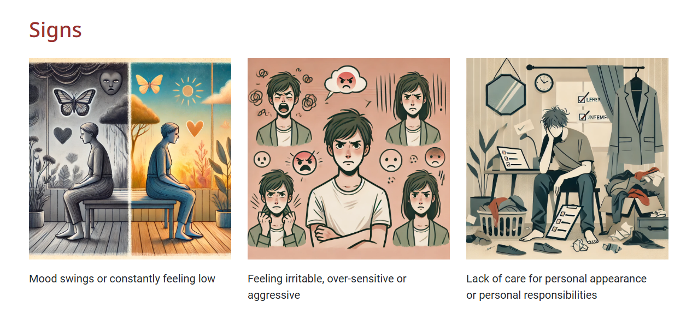
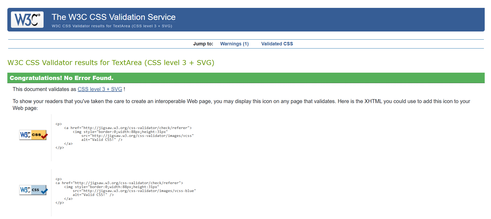

# Mental Health Deserves Awareness

Mental Health Deserves Awareness is a website focused on teaching users about their mental health. A healthy mind leads to a healthy life and everyone in all spheres of life will benefit from proper education on the subject, making its use cut across young people, career-focused individuals, the ederly and many more. This website is ideal for users with little to no experience on the subject, loved ones of people struggling with their mental wellbeing and users worried about their mental health. The goal of the website is to provide a calming introduction to the subject of mental health with relevant links and resources for further reading. 

## Screenshot

[Multi screen picture](http://techsini.com/multi-mockup/index.php) was used to show what my site looks like on different pages.

[Balsamiq](https://balsamiq.com/?gad_source=1&gclid=Cj0KCQiAoae5BhCNARIsADVLzZeJVKfgWX9CTOJnD5-VPt2DjUg2mJwmtkBFQKLCbw5uoQ6B-JHktTMaAuVMEALw_wcB) was used to produce wireframes for differnt screen sizes i.e. phone, tablet and laptop

- Mobile view
  

- Tablet view
  

- Laptop view
  

## User Stories

- As a user, I want a navigation bar that allows me easily jump to sections of interest
- As a user, I want a calming website so I dont get overwhelmed
- As a user, I want to understand the various support options available for mental health issues
- As a user, I want to be able to subsribe to a newsletter to stay up to date with new information on the website
- As a user, I want to learn about common signs of a decline in mental wellbeing
- As a user, I want to be presented with tips that will help me manage my mental wellbeing
- As a user, I want access to the social media handles based on the subject 
- As a user, I want to see positive affirmations on the subject of mental health
- As a user, I want a website that is responsive on all screen sizes

## Design

### Colour palette

The color scheme of the webpage is inspired from an image on the subject of mental health. I used Coolors to extract the colors from my chosen image and then played around with its automatic pallete generator to get the remaining colors needed. I made sure to use a color pallete that was ideal for the nature of the topic

https://coolors.co/palette/c8a398-8d2e29-daffff-b76d66-f9d8c0

### Typography 

For this project, I used Foto sans for header text and Roboto for body text. Due to the nature of the project it was important to use a font that was calm and easy to read to encourage users to progress through the webpage's content. I used google fonts and set the filter to calm and then based on preference selected by desired font for my header text and a suitable supporting body font. 

### Imagery

Images are an important component of this website because different users have different needs. For instance, some users learn best using images whilst others learn through text. I  integrated both of this into the webpage and used Pexels and Open AI to generate the images. I used images from Pexels for my Carouesel images and Open AI images generated using DALL-E for my other sections. 

- Features (general site features, like sections and pages that fulfil teh user stories/requirements)

### Features

#### Navigation bar

To achieve the user story on easy to use navigation, I developed a navigation bar that includes a hamburger icon on mobile and tablet screens and the page links alone on laptop screens

    
Nav bar on mobile screens

    
    

#### Call to action button: Subscribe to newsletter

To achieve the user story on allowing users to subscribe and stay updated, the call to action button was linked to two modals. The first modal allows the user to enter their name and email and click a sign up button which takes them to the second modal showing the success of their request

    
Call to action button linking to two modals

    
    
    

#### Positive affirmations 

To achieve the user story on providing positive affirmations to users, a carousel of encouraging images on the topic was designed into the project and consequently served as the hero image for the project

    
Positive affirmations carousel

    
    

#### Available Support

This section was designed to allow users access available resources to help them through a mental health crisis or wellbeing issue

    
Available support on tablet view

    
    

##### Signs of Mental health issues

This section was designed to allow users to learn different signs of mental health issues and incorporated images to serve the needs of visual learners

    
Signs of mental health issues on desktop view

    
    

#### Tips for Mental Health Wellbeing
This section was designed to allow users to discover tips that promote mental wellbeing and it also incorporated images to serve the needs of visual learners

    
Tips for mental wellbeing on tablet view

    
    

#### Footer: Social Media links
This section focuses on showcasing 3 social media websites users can connect to to stay updated however due to the fictional nature of the project the links take the users to the login/sign up page for these platforms

    
Social media links in the footer in mobile view

    
    

## Languages, Tools & Technologies Used

- Git - version control
- Github - deployment and project management
- HTML 
- CSS
- Bootstrap
- Fontawesome
- Open AI
- VS code
- Beautify formatter extension
- Pexels
- Favicon.io
- Google fonts
- Dev tools

## Media Copyrights

- Photo by Madison Inouye from Pexels: https://www.pexels.com/photo/self-care-isn-t-selfish-signage-2821823/
- Photo by Brett Sayles from Pexels: https://www.pexels.com/photo/you-are-not-alone-quote-board-on-brown-wooden-frame-2821220/
- Photo by Brett Sayles from Pexels: https://www.pexels.com/photo/you-are-not-alone-quote-board-on-brown-wooden-frame-2821220/
- Photo by Tara Winstead from Pexels: https://www.pexels.com/photo/illustration-of-a-head-and-butterflies-around-the-scalp-and-inside-the-brain-8849272/
- Photo by Vie Studio from Pexels: https://www.pexels.com/photo/label-cut-out-papers-on-the-cardboard-7004950/
- Mental Health Icon Graphic by aimagenarium · Creative Fabrica https://images.app.goo.gl/dQEaYMVJvx5PAVmX7

## Testing

### Validator testing

#### HTML Testing 

[HTML Validator](https://validator.w3.org/) was used to test the HTML and there were no errors or warnings

    
HTML validation results

    
    

#### CSS Testing 

[CSS Validator](https://jigsaw.w3.org/css-validator/) was used to test the CSS and there were no errors or warnings

    
CSS testing results

    
    

#### Lighthouse Testing

Lighthouse was used in Chrome Dev tools to check the performance, accessibility, progressive and SEO of the website based on mobile and desktop view and the results were all above 70% on both views, with desktop performing slightly higher than mobile.

    
Lighthouse testing results on desktop

    
    

 

    
Lighthouse testing results on mobile

    
    

### Manual testing

Here are the manual tests that were performed on the website

| Test                    | Device     | Result       |
| ----------------------- | ---------- | ------------ |
|Check all pages render   | ALL        | Pass         |
|Check input validation on contact page          | ALL        | Pass         |
|Check the first modal works        | ALL     | Pass         |
|Check the second modal works   | ALL        | Pass         |
|Check the call to action button works   | ALL        | Pass         |
|Check all links work  | ALL        | Pass         |
|Check all links open in new tabs   | ALL        | Pass         |
|Check all images render   | ALL        | Pass         |
|Check to make sure the navbar works   | ALL        | Pass         |

#### Bugs

- Footer does not extend to full width of the bottom of the page for screen sizes bigger than mobile
- Modal allows user subscribe without entering a valid email address

## Leverage of AI: Open AI and Dall E

Due to the time constraint and sensitivity of the topic, Open AI was an impactful tool used in development to produce an effective and efficient website for the topic.

A few examples of areas where good prompt engineering and the use of AI were notable include:

    
Choosing a body text using Open AI

    
    

 

    
Generating images using Open AI Dall E

    
    

 

    
Debugging code using Open AI Dall E

    
    

 

    
Generating sensitive content with Open AI

    
    

 
Overall, the use of AI was positive and effective in designing the project

## Deployment

During this project, Git was an essential tracking tool used to monitor the progress of the website towards final deployments. Git commits were used to allow version tracking and restoring previous states if needed amongst Git push, Git pull, Git add. These commits were stored and Github was used to store the project and deploy the site.

GitHub was used to deploy the website. These were the steps taken to acheive this:  

1. Login to GitHub account
2. Navigate to the project repository, mental_health_deserves_awareness
3. Click the Settings button near the top of the page
4. In the left-hand menu, find and click on the Pages button
5. In the Source section, choose 'main' from the drop-down, select branch menu
6. Select 'root' from the drop-down folder menu
7. Click 'Save' and after a few moments the project will have been made live and a link is visible at the top of the page